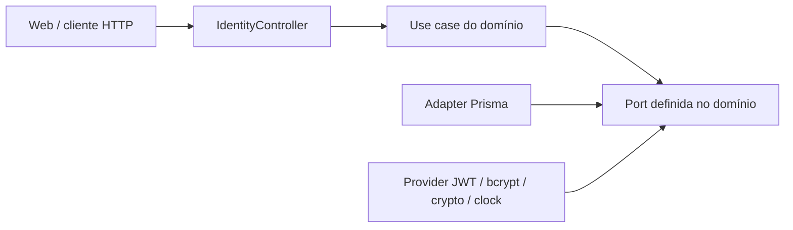
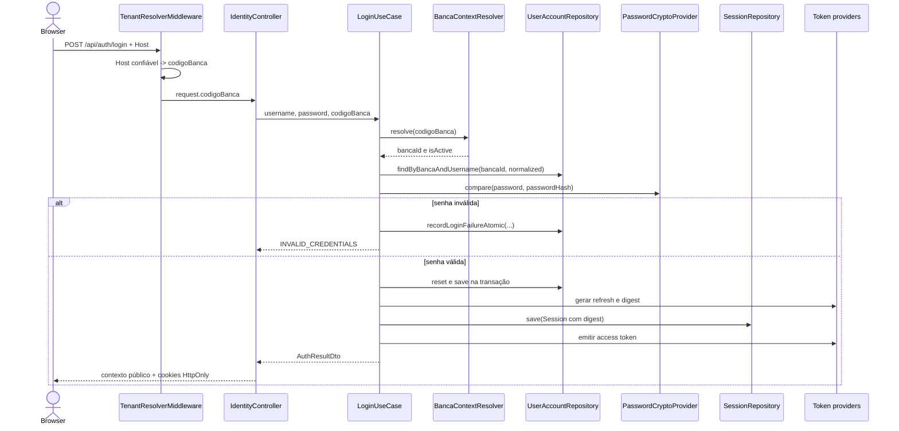
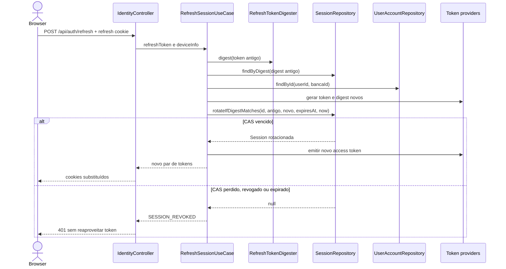
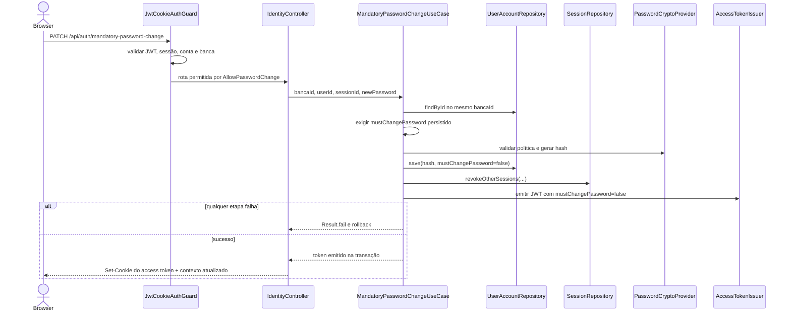

# Identity no Backend

## Responsabilidade e limite

Este diretório é a camada de infraestrutura/adapters e o composition root NestJS de Identity. Ele transforma HTTP em entradas dos casos de uso, liga as ports do domínio a implementações concretas e traduz `Result` para HTTP. Regras de conta, senha, sessão, autorização e lockout pertencem ao pacote [`@bancaflow/identity`](../../../../../modules/identity/README.md), não a controllers, guards ou adapters Prisma.

O backend pode depender do domínio; o domínio não conhece NestJS, Prisma, bcrypt ou JWT. A visão canônica de Prisma, transações, configuração e execução está no [README do backend](../../../README.md).

## Direção das dependências

Pergunta respondida: **para onde apontam as dependências e onde ocorre a inversão via ports?**

`IdentityModule` importa `DbModule` e `TenancyModule`, registra `IdentityController` e `JwtCookieAuthGuard`, liga ports a adapters e constrói cada caso de uso com `useFactory`. Ele exporta `CREATE_USER_ACCOUNT_USE_CASE`, `USER_ACCOUNT_REPOSITORY` e `SESSION_REPOSITORY`. O método `configure()` aplica `TenantResolverMiddleware` **somente** a `POST auth/login`; depois do prefixo global de `main.ts`, a rota pública é `/api/auth/login`.

`TenancyModule` fornece o `BancaContextResolver` necessário ao login. A dependência é direta e unidirecional; não há `forwardRef`. A composição que precisa dos dois bounded contexts fica no [`PlatformProvisioningModule`](../platform/README.md).

## Tokens de injeção e composição

| Token                                | Implementação/factory                          | Papel                                                                       |
| ------------------------------------ | ---------------------------------------------- | --------------------------------------------------------------------------- |
| `USER_ACCOUNT_REPOSITORY`            | `UserAccountRepositoryPrisma`                  | Persistência de `UserAccount`, isolamento por `bancaId` e CAS por `version` |
| `SESSION_REPOSITORY`                 | `SessionRepositoryPrisma`                      | Persistência, consulta, revogação e rotação de `Session`                    |
| `PASSWORD_CRYPTO_PROVIDER`           | `BcryptPasswordCryptoProvider`                 | Hash e comparação de senha com bcrypt                                       |
| `ACCESS_TOKEN_ISSUER`                | `JwtAccessTokenIssuer`                         | Emissão de access token JWT                                                 |
| `REFRESH_TOKEN_GENERATOR`            | `CryptoRefreshTokenGenerator`                  | Refresh token opaco via CSPRNG                                              |
| `REFRESH_TOKEN_DIGESTER`             | `HmacRefreshTokenDigester`                     | Digest HMAC-SHA-256 do refresh token                                        |
| `TEMPORARY_PASSWORD_GENERATOR`       | `CryptoTemporaryPasswordGenerator`             | Senha temporária forte via CSPRNG                                           |
| `CLOCK`                              | `SystemClockProvider`                          | Relógio real atrás da port `Clock`                                          |
| `TRANSACTION_MANAGER`                | `useExisting: PrismaService`                   | Fronteira transacional de Identity                                          |
| `BANCA_CONTEXT_RESOLVER`             | `useExisting: BancaContextResolver` de Tenancy | Resolve o contexto público da banca sem expor `Banca`                       |
| `LOGIN_USE_CASE`                     | factory de `LoginUseCase`                      | Login multi-tenant                                                          |
| `REFRESH_SESSION_USE_CASE`           | factory de `RefreshSessionUseCase`             | Rotação de refresh e novo JWT                                               |
| `LOGOUT_USE_CASE`                    | factory de `LogoutUseCase`                     | Revoga a sessão atual                                                       |
| `LOGOUT_ALL_USE_CASE`                | factory de `LogoutAllUseCase`                  | Revoga todas as sessões da conta                                            |
| `LIST_SESSIONS_USE_CASE`             | factory de `ListSessionsUseCase`               | Lista sessões ativas da conta                                               |
| `REVOKE_SESSION_USE_CASE`            | factory de `RevokeSessionUseCase`              | Revoga uma sessão da mesma conta/banca                                      |
| `CHANGE_PASSWORD_USE_CASE`           | factory de `ChangePasswordUseCase`             | Troca voluntária                                                            |
| `MANDATORY_PASSWORD_CHANGE_USE_CASE` | factory de `MandatoryPasswordChangeUseCase`    | Troca obrigatória autorizada pelo estado persistido                         |
| `ADMIN_RESET_PASSWORD_USE_CASE`      | factory de `AdminResetPasswordUseCase`         | Reset administrativo e senha temporária                                     |
| `TOGGLE_ACCOUNT_STATUS_USE_CASE`     | factory de `ToggleAccountStatusUseCase`        | Ativa, desativa, bloqueia ou desbloqueia                                    |
| `CREATE_USER_ACCOUNT_USE_CASE`       | factory de `CreateUserAccountUseCase`          | Port de entrada exportada para provisionamento                              |

## Contrato HTTP

Todos os corpos passam pelo `ValidationPipe` global com `whitelist`, `forbidNonWhitelisted` e `transform`. `IdentityController` apenas faz binding, chama o caso de uso, configura cookies e usa `STATUS_BY_CODE`; o envelope de falha contém `statusCode`, `error`, `code` e `message`.

| Verbo e rota                                | Guard/decorator                                | DTO ou entrada                                         | Caso de uso                      | Resposta de sucesso                                           | Erros principais via `STATUS_BY_CODE`                                           |
| ------------------------------------------- | ---------------------------------------------- | ------------------------------------------------------ | -------------------------------- | ------------------------------------------------------------- | ------------------------------------------------------------------------------- |
| `POST /api/auth/login`                      | Público; `TenantResolverMiddleware`            | `LoginDto` (`username`, `password`); banca vem do host | `LoginUseCase`                   | Contexto público de auth + cookies                            | `INVALID_CREDENTIALS` → 401; conflito de concorrência → 409                     |
| `POST /api/auth/refresh`                    | Público; refresh cookie                        | `RefreshDto` (`deviceInfo?`)                           | `RefreshSessionUseCase`          | Contexto público + par de cookies rotacionado                 | `INVALID_CREDENTIALS`/`SESSION_REVOKED` → 401                                   |
| `POST /api/auth/logout`                     | `JwtCookieAuthGuard`, `@AllowPasswordChange()` | Claims do token                                        | `LogoutUseCase`                  | `{ success: true }`; limpa cookies                            | sessão ausente/revogada → 401                                                   |
| `POST /api/auth/logout-all`                 | `JwtCookieAuthGuard`, `@AllowPasswordChange()` | Claims do token                                        | `LogoutAllUseCase`               | `{ success: true }`; limpa cookies                            | credenciais/sessão/conta/banca inválidas → 401                                  |
| `GET /api/auth/sessions`                    | `JwtCookieAuthGuard`                           | Claims do token                                        | `ListSessionsUseCase`            | Lista de sessões ativas                                       | `MUST_CHANGE_PASSWORD`/`FORBIDDEN` → 403; auth → 401                            |
| `GET /api/auth/me`                          | `JwtCookieAuthGuard`                           | Somente `AuthContext` (`userId`/`bancaId`); ignora body/query/param | `GetAuthenticatedUserContextUseCase` | `{ userId, username, name, email, role, banca: { bancaId, codigoBanca, name } }` (sem `isActive`) | Guard: `SESSION_REVOKED`/`ACCOUNT_INACTIVE`/`BANCA_INACTIVE` → 401, `MUST_CHANGE_PASSWORD` → 403; inconsistência pós-guard → `401 INVALID_CREDENTIALS`; falha técnica → `500` genérico |
| `DELETE /api/auth/sessions/:sessionId`      | `JwtCookieAuthGuard`                           | `@Param sessionId` + claims                            | `RevokeSessionUseCase`           | Resultado da revogação                                        | sessão ausente → 401; proibido → 403                                            |
| `PATCH /api/auth/password`                  | `JwtCookieAuthGuard`                           | `ChangePasswordDto`                                    | `ChangePasswordUseCase`          | Contexto atualizado + novo access cookie                      | `INVALID_CREDENTIALS` → 401; `PASSWORD_TOO_WEAK` → 422; troca obrigatória → 403 |
| `PATCH /api/auth/mandatory-password-change` | `JwtCookieAuthGuard`, `@AllowPasswordChange()` | `MandatoryPasswordChangeDto`                           | `MandatoryPasswordChangeUseCase` | Contexto com `mustChangePassword: false` + novo access cookie | `FORBIDDEN`/`MUST_CHANGE_PASSWORD` → 403; senha fraca → 422                     |
| `PATCH /api/auth/admin/reset-password`      | `JwtCookieAuthGuard`                           | `AdminResetPasswordDto`                                | `AdminResetPasswordUseCase`      | `userId` + senha temporária retornada uma vez                 | `FORBIDDEN` → 403; conta não encontrada → 404; senha fraca → 422                |
| `PATCH /api/accounts/:accountId/status`     | `JwtCookieAuthGuard`                           | `ToggleAccountStatusDto` + `@CurrentBancaId()`         | `ToggleAccountStatusUseCase`     | `userId` e novo `status`                                      | `FORBIDDEN` → 403; conflito de versão → 409; contador inválido → 400            |

Outros códigos presentes em `STATUS_BY_CODE`: `ACCOUNT_LOCKED` → 423, `USERNAME_ALREADY_EXISTS` → 409, `BANCA_NOT_FOUND`/`BANCA_INACTIVE`/`ACCOUNT_INACTIVE` → 401 e `TENANCY.NOME_INVALID` → 400. Um código de domínio não listado cai em 400. As validações de DTO também retornam 400 antes do caso de uso.

### Taxonomia de falhas do `GET /api/auth/me` (A/B/C)

O `unwrap` do controller aplica três categorias distintas, preservando o contrato público do guard e evitando reclassificar falhas técnicas:

- **A — rejeições do guard.** O `JwtCookieAuthGuard` roda antes do caso de uso e emite os códigos já estabelecidos, que o controller **não** intercepta nem generaliza: token inválido/ausente → `401 INVALID_CREDENTIALS`; sessão revogada ou expirada → `401 SESSION_REVOKED`; conta ausente/inativa/`BLOCKED` → `401 ACCOUNT_INACTIVE`; banca ausente/inativa → `401 BANCA_INACTIVE`; troca obrigatória → `403 MUST_CHANGE_PASSWORD` (a rota não tem `@AllowPasswordChange`). O guard distingue **estado esperado** (`Result.ok(null)` / revogada / inativa → 401 acima) de **falha técnica** dos seus repositories (`Result.fail` de sessão, conta ou banca): esta última é categoria C — `500` genérico via `InternalServerErrorException`, **nunca** colapsada em `SESSION_REVOKED`/`ACCOUNT_INACTIVE`/`BANCA_INACTIVE`.
- **B — inconsistência pós-guard.** Conta ou banca que some/fica inativa entre a aprovação do guard e a leitura, divergência de `bancaId` ou projeção ausente vira `401 INVALID_CREDENTIALS`, **sem contexto parcial** e sem revelar qual registro mudou. Nasce das queries: ausência esperada é `Result.ok(null)` (conta) ou `BANCA_NOT_FOUND`→`null` (banca no `BancaDisplayContextResolver`).
- **C — falha técnica.** Erros de Prisma/conexão/timeout dos adapters de query de Identity **ou** Tenancy são capturados com `safeErrorCode` e retornam um código técnico estável: `IDENTITY.USER_ACCOUNT_QUERY_ERROR` / `TENANCY.BANCA_DISPLAY_QUERY_ERROR` (ver [`technical-error-codes.ts`](../../shared/errors/technical-error-codes.ts)). Esses códigos são reconhecidos por `isTechnicalFailureCode` e traduzidos **simetricamente** para `500` com resposta externa genérica (`GENERIC_INTERNAL_ERROR_MESSAGE`), **nunca** `400`/`401`. O mesmo vale para falha técnica dos repositories **dentro do guard**, que também retorna `500` genérico. A resposta não expõe código interno, mensagem técnica, stack ou detalhe Prisma. A causa é registrada apenas internamente por `logTechnicalFailure` como **log estruturado e sanitizado** (escopo, operação e código técnico + resumo seguro do erro — nome da classe e código Prisma como `P2002`; **sem** `message`, `meta`, stack ou valores).

A distinção B×C nasce no contrato das queries (ausência esperada ≠ falha de execução) e é preservada pelo `GetAuthenticatedUserContextUseCase` e pelo `BancaDisplayContextResolver` até a borda HTTP.

## Autenticação autoritativa e contexto

`JwtCookieAuthGuard` é reexecutado em cada request protegida:

1. lê `access_token` do cookie e verifica assinatura/expiração JWT;
2. busca a sessão por `sessionId` e `bancaId` e exige que não esteja revogada nem expirada;
3. busca a conta no mesmo `bancaId` e exige estado ativo;
4. busca a banca e exige estado ativo;
5. converte claims em `AuthContext` e preenche `request.authUser`;
6. se `mustChangePassword` estiver ativo, só permite handlers marcados com `@AllowPasswordChange()`.

`@CurrentUser()` injeta o contexto autenticado (ou um campo); `@CurrentBancaId()` injeta o `bancaId` autoritativo do token, nunca do body. `@AllowPasswordChange()` permite apenas sair ou concluir a troca obrigatória; a autorização definitiva da troca obrigatória ainda é a flag **persistida** da conta, verificada pelo caso de uso.

### Divergência importante

As rotas deste módulo usam `JwtCookieAuthGuard`, não a pilha Passport `JwtGuard`/`JwtStrategy` de `shared/auth`. Essa pilha está registrada e exportada, mas não protege estes endpoints. Consequentemente, `@Public()` só é interpretado por `JwtGuard` e não altera `JwtCookieAuthGuard`.

## Resolução segura do tenant

`TenantResolverMiddleware` converte host em `codigoBanca` e anexa o resultado à request de login. O host deve terminar com `BANCA_HOST_SUFFIX`, conter exatamente um subdomínio e não usar `www`, `api`, `admin`, `app` ou `status`. Entrada ausente ou inválida fica sem contexto; o domínio responde com erro genérico e não revela banca/conta.

Por padrão usa `Host`. `X-Forwarded-Host` só é aceito quando **ambas** as condições são verdadeiras: `TRUST_PROXY_HOST=true` e o peer TCP imediato pertence a `TRUSTED_PROXY_IPS`. `isTrustedPeer` aceita IP/CIDR, normaliza IPv4 mapeado em IPv6 e ignora entradas inválidas. Allowlist vazia ou peer desconhecido falha fechado; `X-Forwarded-For` não decide confiança.

No desenvolvimento, use apenas loopback controlado e um host local que respeite o sufixo. Em produção, cadastre somente IPs/CIDRs reais do proxy de borda; sem proxy confiável, desative `TRUST_PROXY_HOST`. Os nomes e exemplos seguros estão em [`.env.example`](../../../.env.example).

## Credenciais, tokens e cookies

- `BcryptPasswordCryptoProvider` protege passwords com bcrypt; o custo vem de `BCRYPT_ROUNDS` (default 12).
- `CryptoRefreshTokenGenerator` produz 64 bytes aleatórios em hexadecimal. O valor bruto vai apenas ao cliente.
- `HmacRefreshTokenDigester` produz HMAC-SHA-256 com segredo próprio; somente o digest determinístico é persistido.
- `JwtAccessTokenIssuer` emite claims `sub`, `bancaId`, `sessionId`, `role` e `mustChangePassword`; o TTL é configurável.
- `CryptoTemporaryPasswordGenerator` usa CSPRNG, 16 caracteres e garante classes de caracteres; o reset devolve a senha temporária uma única vez ao chamador autorizado.
- `access_token`: `HttpOnly`, `SameSite=Strict`, `Secure` em produção, `Path=/`.
- `refresh_token`: os mesmos flags, mas `Path=/api/auth/refresh`, reduzindo onde o browser o envia.

Os cookies são host-only porque nenhum `Domain` é definido. Logout limpa os dois com os mesmos atributos de path/segurança. Nunca registre token bruto, digest, hash ou senha.

## Concorrência e transações

As fronteiras completas estão no [guia canônico de Prisma/transações](../../../README.md#prisma-transações-e-mapeamento). Os mecanismos específicos são:

- falha de login: `recordLoginFailureAtomic` abre transação própria e usa `SELECT ... FOR UPDATE`, serializando incrementos; esse efeito persiste fora da transação do login;
- escrita de conta: `persist` faz CAS otimista com `WHERE id = ? AND version = ?`; zero linhas gera conflito 409;
- refresh: `rotateIfDigestMatches` atualiza somente sessão ativa, não expirada e ainda com o digest antigo; corrida perdida retorna `null` e vira `SESSION_REVOKED`;
- bloqueio/desativação: `ToggleAccountStatusUseCase`, não o adapter, salva a conta e chama `revokeAll` na mesma transação. Assim a regra permanece visível e independente de Prisma.

`TRANSACTION_MANAGER` e `TENANCY_TRANSACTION_MANAGER` são tokens distintos, mas ambos usam `useExisting: PrismaService`, isto é, a mesma instância e o mesmo contexto transacional ambiente.

## Fluxo de login multi-tenant

Pergunta respondida: **como o host vira um login isolado por banca e uma sessão?**

## Fluxo de refresh com rotação

Pergunta respondida: **como duas chamadas com o mesmo refresh token não vencem a corrida?**

## Fluxo de troca obrigatória

Pergunta respondida: **quem autoriza a troca sem senha atual e como o usuário sai do estado obrigatório atomicamente?**

## Testes que sustentam esta infraestrutura

- unitários: [`dto.spec.ts`](dto/dto.spec.ts), [`jwt-cookie-auth.guard.spec.ts`](guards/jwt-cookie-auth.guard.spec.ts), [`tenant-resolver.middleware.spec.ts`](../../shared/middleware/tenant-resolver.middleware.spec.ts), além de [`security.config.spec.ts`](../../config/security.config.spec.ts) e [`prisma.service.spec.ts`](../../db/prisma.service.spec.ts);
- e2e/integração real: [`identity.e2e-spec.ts`](../../../test/identity/identity.e2e-spec.ts), [`concurrency.e2e-spec.ts`](../../../test/identity/concurrency.e2e-spec.ts), [`session-rotation.e2e-spec.ts`](../../../test/identity/session-rotation.e2e-spec.ts), [`tenant-isolation.e2e-spec.ts`](../../../test/identity/tenant-isolation.e2e-spec.ts), [`toggle-status.e2e-spec.ts`](../../../test/identity/toggle-status.e2e-spec.ts), [`transaction.e2e-spec.ts`](../../../test/identity/transaction.e2e-spec.ts) e [`proxy-trust.e2e-spec.ts`](../../../test/identity/proxy-trust.e2e-spec.ts).

## Decisões do MVP e fora de escopo

O MVP usa cookies host-only, um guard próprio autoritativo e provisionamento sem endpoint HTTP. MFA, recuperação por e-mail e permissões granulares não estão implementados. Alterar essas decisões exige primeiro mudar contratos e regras no domínio, com testes; não antecipe comportamento no controller.

## Erros comuns ao evoluir este módulo

- Colocar regra de senha, papel, status ou tenant no controller/guard em vez do domínio.
- Aceitar `bancaId` ou `codigoBanca` do body; o primeiro vem do token e o segundo do host confiável.
- Proteger uma rota Identity apenas com `@Public()` ou assumir que `JwtGuard` é o guard usado aqui.
- Tornar `trust proxy` irrestrito ou confiar em `X-Forwarded-Host` sem validar o peer TCP.
- Persistir/logar refresh token bruto, senha temporária, password hash ou secret.
- Rotacionar sessão com leitura seguida de `save`, perdendo o CAS atômico.
- Revogar sessões implicitamente no adapter de conta, escondendo a regra do caso de uso.
- Criar dependência circular com Tenancy ou introduzir `forwardRef` em vez de compor no platform.
- Configurar/limpar cookies com paths diferentes, deixando cookies antigos ativos.
- Atualizar endpoint, DTO ou mapeamento de erros sem atualizar este README e os testes correspondentes.

## Checklist para adicionar um novo endpoint

- [ ] Definir/alterar primeiro o caso de uso e suas ports no domínio, sem NestJS/Prisma.
- [ ] Criar DTO apenas para validação de fronteira; manter regra autoritativa no domínio.
- [ ] Registrar token e factory no `IdentityModule`, injetando ports por tokens.
- [ ] Adicionar método fino no `IdentityController` e escolher explicitamente guard/decorators.
- [ ] Nunca receber `bancaId` do body; derivá-lo do contexto autenticado.
- [ ] Mapear novos códigos no `STATUS_BY_CODE` sem expor erro de infraestrutura.
- [ ] Revisar atomicidade, concorrência, cookies e comportamento de `mustChangePassword`.
- [ ] Cobrir DTO/guard/controller e o fluxo e2e, incluindo isolamento de tenant e falhas.
- [ ] Atualizar a tabela HTTP e, se o fluxo arquitetural mudou, o diagrama correspondente.
