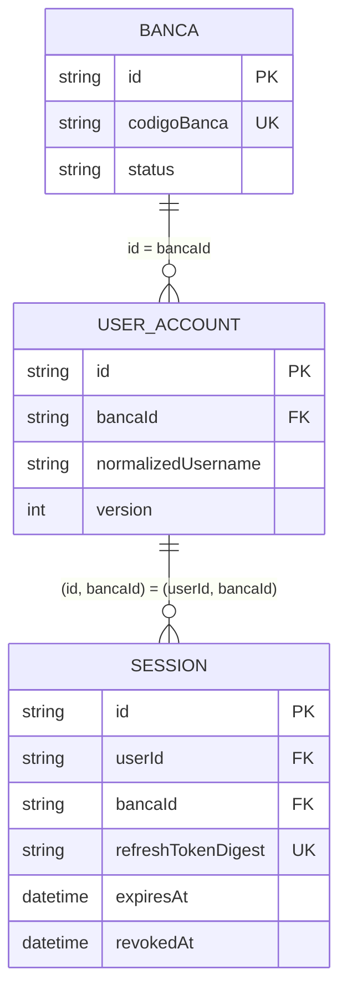

# Identity — domínio de contas e sessões

## Responsabilidade e limite do bounded context

Identity responde por **quem pode se autenticar em uma banca e por quanto tempo**. O módulo contém os agregados [`UserAccount`](./src/user-account/user-account.entity.ts) e [`Session`](./src/session/session.entity.ts), suas regras, casos de uso e ports. Uma conta concentra identidade, papel, estado e credencial; uma sessão concentra o ciclo de vida do refresh token. Esses conceitos mudam por motivos de autenticação e autorização, portanto pertencem a Identity.

[`Banca`](../tenancy/src/banca/banca.entity.ts) não pertence aqui: existência, código público e estado operacional de um tenant mudam por motivos de Tenancy. Identity não importa `@bancaflow/tenancy` nem recebe uma entidade `Banca`; consulta somente `{ bancaId, isActive }` pela port [`BancaContextResolver`](./src/shared/ports/banca-context-resolver.port.ts). A dependência entre os pacotes é unidirecional: `shared ← identity ← tenancy` (a seta aponta para a dependência). A integração concreta é feita fora do domínio.

O pacote é TypeScript puro e depende apenas de `@bancaflow/shared`. Prisma, NestJS, JWT, bcrypt, HMAC e cookies são detalhes implementados no backend por adapters das ports definidas aqui.

## Modelo de domínio

### Agregado `UserAccount`

[`UserAccount`](./src/user-account/user-account.entity.ts) tem identidade por `id` e sempre pertence a um `bancaId`. É uma entidade rica: não oferece setters para trocar campos livremente; protege transições por métodos que devolvem uma **nova instância** em `Result<UserAccount>`.

`tryCreate` valida e normaliza:

- `id` e `bancaId` como `Id` válidos;
- `username` por `Username`, preservando a grafia em `raw` e usando `normalized` para comparação;
- `name` por `PersonName` e `email`, quando presente, por `Email`, ambos de `@bancaflow/shared`;
- `role`, `status` e `credential` pelos respectivos Value Objects;
- `failedLoginAttempts >= 0`, com default `0`;
- datas mutáveis de janela e bloqueio por cópia defensiva e `version` com default `1`.

O ciclo de vida é expresso por estes comportamentos:

| Método | Regra e transição |
|---|---|
| `activate()` | define `ACTIVE` e limpa contador, início da janela e bloqueio temporário |
| `deactivate()` | define `INACTIVE`; falha com `FORBIDDEN` para `OWNER` |
| `block()` | define `BLOCKED`; falha com `FORBIDDEN` para `OWNER` |
| `unblock()` | define `ACTIVE` e limpa os três campos de falha/bloqueio |
| `recordLoginFailure(now)` | abre/reinicia a janela ou incrementa o contador; a 5ª falha dentro da janela bloqueia por 15 minutos |
| `resetLoginFailures()` | zera contador, início da janela e `lockedUntil` |
| `changePassword(hash, mustChangePassword, changedAt)` | cria uma nova `Credential`; hash vazio é inválido |
| `isActive()` / `isLocked(now)` | consultam, respectivamente, o status persistido e o bloqueio temporário |

A janela de falhas dura 15 minutos. Uma falha ocorrida **mais de** 15 minutos após o início abre uma nova janela com contador `1`; ao chegar a `5`, `lockedUntil` recebe `now + 15 minutos`. O bloqueio temporário mantém o status `ACTIVE` e é diferente do bloqueio administrativo `BLOCKED`.

`deactivate` e `block` protegem um `OWNER` mesmo quando chamados diretamente. Além disso, [`ToggleAccountStatusUseCase`](./src/user-account/use-case/toggle-account-status.use-case.ts) impede `ADMIN` de gerenciar `OWNER` e revoga sessões ao bloquear/desativar. Assim, a entidade protege a invariante local e o caso de uso protege a regra que envolve dois agregados.

Os getters de `Date` devolvem cópias. As transições usam o helper privado `rebuild`, que combina os props com clone raso e passa novamente por `tryCreate`. Isso evita o `deepMerge` da classe-base, que trataria `Date` como objeto comum e poderia corrompê-la. `version` é apenas transportada pelo domínio; o compare-and-swap otimista pertence ao adapter de persistência.

### Agregado `Session`

[`Session`](./src/session/session.entity.ts) representa uma sessão de autenticação identificada por `id`, ligada ao par `userId` + `bancaId`. `tryCreate` exige identificadores válidos, digest não vazio e `expiresAt` como `Date` válida. `expiresAt` e `revokedAt` entram e saem por cópia defensiva; `deviceInfo` é metadado opcional.

A sessão persiste apenas `refreshTokenDigest`. O refresh token bruto é devolvido uma vez ao cliente e **nunca** deve ser armazenado ou registrado em logs.

- `isExpired(now)` considera expirada quando `expiresAt <= now`.
- `isRevoked()` verifica a presença de `revokedAt`.
- `isActive(now)` exige simultaneamente não revogada e não expirada.
- `revoke(now)` cria nova instância e falha com `SESSION_REVOKED` se já revogada.
- `rotate(newDigest, newExpiresAt, now)` exige sessão não revogada, digest não vazio e expiração estritamente posterior ao `now` recebido.

O `now` é autoritativo: nem a entidade nem a port de rotação consultam o relógio do sistema. Isso torna os testes determinísticos e impede renovar uma sessão usando sua expiração antiga como referência. A entidade valida a transição; a persistência concorrente é feita por `SessionRepository.rotateIfDigestMatches`, que compara digest e atividade atomicamente.

Assim como `UserAccount`, `Session` usa `rebuild` em vez de `deepMerge`, preservando corretamente as instâncias de `Date`.

### Value Objects

| Value Object | Invariantes e normalização |
|---|---|
| [`Username`](./src/user-account/vo/username.vo.ts) | `trim`, lowercase para `normalized`, preservação do valor aparado em `raw`; regex `^[a-z0-9._-]{3,30}$`; o objeto retornado por `value` é cópia |
| [`AccountRole`](./src/user-account/vo/account-role.vo.ts) | `trim` + uppercase; somente `OWNER`, `ADMIN`, `USER`; expõe `isOwner`, `isAdmin` e `canManageAccounts` |
| [`AccountStatus`](./src/user-account/vo/account-status.vo.ts) | `trim` + uppercase; somente `ACTIVE`, `INACTIVE`, `BLOCKED`; apenas `ACTIVE` autentica |
| [`Credential`](./src/user-account/vo/credential.vo.ts) | hash aparado e não vazio, `passwordChangedAt` válida por construção e flag com default `false`; não valida formato bcrypt; devolve objeto e datas por cópia defensiva |

Um Value Object é definido pelo valor e impede estados inválidos na criação. A entidade rica acrescenta identidade, ciclo de vida e métodos de transição. Transformar `UserAccount` ou `Session` em estruturas anêmicas e mover suas regras para controllers/adapters permitiria alterações sem validar invariantes e inverteria a responsabilidade do domínio.

## Regras de negócio e isolamento multi-tenant

- Username é case-insensitive para autenticação e único pelo par `(bancaId, normalizedUsername)`, não globalmente. O mesmo username pode existir em bancas diferentes.
- Toda leitura por conta ou sessão usa `bancaId`; uma busca cross-tenant retorna ausência/erro genérico e não revela que o registro existe em outra banca.
- A exceção estrutural é `findByDigest`: o digest é globalmente único e serve para localizar a sessão; depois dela, conta e efeitos usam o `bancaId` armazenado na própria sessão.
- `OWNER` e `ADMIN` podem administrar contas; `ADMIN` não gerencia `OWNER`. `USER` não administra contas. Permissões granulares estão fora do MVP.
- Apenas conta `ACTIVE` autentica ou renova. `BLOCKED` administrativo é diferente de `lockedUntil` temporário.
- Senhas novas e temporárias seguem `StrongPassword`; o domínio conhece a política, mas não conhece o algoritmo de hash.
- Bloquear ou desativar revoga todas as sessões na mesma transação. Trocar senha revoga as outras sessões e preserva a atual.
- Refresh token é opaco, rotacionado a cada refresh e persistido somente como digest. Uma corrida perdida na rotação falha sem emitir novo token.
- Não existe cadastro público no MVP. `CreateUserAccountPort` é consumida pelo provisionamento interno de Tenancy, que informa `role: 'OWNER'` explicitamente.

## Casos de uso

As entradas e saídas abaixo são contratos TypeScript exportados junto de cada classe. “Falhas de port” significa que erros de infraestrutura recebidos em `Result.fail` são propagados, salvo quando o caso de uso deliberadamente os converte em resposta genérica para não revelar dados.

### Autenticação e sessões

| Caso de uso | Entrada → saída | Pré-condições, efeitos, ports e erros | Transação e rollback |
|---|---|---|---|
| [`LoginUseCase`](./src/app/use-case/login.use-case.ts) | `{ codigoBanca, username, password, deviceInfo? }` → `AuthResultDto` | Normaliza username; resolve banca ativa; busca conta `ACTIVE` e não bloqueada; compara senha. Usa `BancaContextResolver`, repositórios, crypto, gerador/digester, emissor e `Clock`. Falhas de autenticação retornam sempre `INVALID_CREDENTIALS`. Senha errada chama `recordLoginFailureAtomic`. No sucesso, zera falhas, cria sessão de 7 dias e emite tokens. | O incremento por senha errada fica **fora** da transação e persiste mesmo com login negado. No sucesso, reset + conta + sessão + emissão usam `runInTransactionResult`; qualquer `Result.fail` reverte as escritas. |
| [`RefreshSessionUseCase`](./src/app/use-case/refresh-session.use-case.ts) | `{ refreshToken, deviceInfo? }` → `AuthResultDto` | Calcula digest, localiza sessão ativa e conta `ACTIVE`, gera novo refresh/digest e valida `Session.rotate`. Usa `SessionRepository`, `UserAccountRepository`, gerador, digester, emissor e `Clock`. Token/sessão/conta inválidos retornam `INVALID_CREDENTIALS`; CAS perdido retorna `SESSION_REVOKED`. | `rotateIfDigestMatches` + emissão do access token ocorrem em `runInTransactionResult`; falha de emissão reverte a rotação. Validações e geração anteriores não escrevem. |
| [`LogoutUseCase`](./src/app/use-case/logout.use-case.ts) | `{ bancaId, sessionId }` → `{ sessionId }` | Busca escopada pela banca e revoga/salva se ativa. É idempotente para sessão ausente ou já revogada. Propaga falha de busca/salvamento; uma falha impossível de `revoke` após a pré-checagem resulta no retorno idempotente. | Não abre transação; há no máximo uma gravação de sessão. |
| [`LogoutAllUseCase`](./src/app/use-case/logout-all.use-case.ts) | `{ bancaId, userId }` → `{ userId }` | Chama `revokeAll` com `Clock.now`; propaga falha do repositório. | Não abre transação de domínio; a atomicidade da atualização em lote pertence ao repositório. |
| [`ListSessionsUseCase`](./src/app/use-case/list-sessions.use-case.ts) | `{ bancaId, userId }` → `SessionInfoDto[]` | `findActiveByUser` retorna apenas sessões ativas da conta na banca; projeta `sessionId`, `createdAt`, `deviceInfo`. Propaga falha do repositório e não expõe digest. | Somente leitura. |
| [`RevokeSessionUseCase`](./src/app/use-case/revoke-session.use-case.ts) | `{ bancaId, userId, sessionId }` → `{ sessionId }` | Exige que a sessão encontrada na banca pertença ao usuário; caso contrário retorna `SESSION_NOT_FOUND`. Já revogada é sucesso idempotente; falhas de port são propagadas. | Não abre transação; há no máximo uma gravação. |

### Contas e credenciais

| Caso de uso | Entrada → saída | Pré-condições, efeitos, ports e erros | Transação e rollback |
|---|---|---|---|
| [`CreateUserAccountUseCase`](./src/user-account/use-case/create-user-account.use-case.ts) | dados da conta, senha, `role` obrigatório → `{ userId, username, role }` | Valida `Username`, `AccountRole`, `StrongPassword`, unicidade na banca, gera hash e cria conta `ACTIVE`. Usa `UserAccountRepository`, `PasswordCryptoProvider`, `Clock`. Principais erros: `PASSWORD_TOO_WEAK`, `USERNAME_ALREADY_EXISTS`, erros de VO/entidade e ports. | Não abre transação própria: é uma única gravação e pode participar da transação ambiente de `ProvisionBanca`. |
| [`ChangePasswordUseCase`](./src/user-account/use-case/change-password.use-case.ts) | `{ bancaId, userId, currentPassword, newPassword, currentSessionId }` → `{ userId, accessToken, accessTokenExpiresAt }` | Sessão atual é obrigatória; conta deve existir; senha atual deve conferir; nova senha deve ser forte. Atualiza credencial com `mustChangePassword=false`, revoga outras sessões e reemite token. Erros: `SESSION_NOT_FOUND`, `ACCOUNT_NOT_FOUND`, `INVALID_CREDENTIALS`, `PASSWORD_TOO_WEAK` e falhas de ports. | Save + `revokeOtherSessions` + emissão usam `runInTransactionResult`; qualquer falha reverte hash e revogações. |
| [`MandatoryPasswordChangeUseCase`](./src/user-account/use-case/mandatory-password-change.use-case.ts) | `{ bancaId, userId, newPassword, currentSessionId }` → novo access token | Não recebe senha atual. A autorização autoritativa lê `mustChangePassword=true` da conta persistida, independentemente de role ou claim. Erros: `SESSION_NOT_FOUND`, `ACCOUNT_NOT_FOUND`, `FORBIDDEN`, `PASSWORD_TOO_WEAK` e ports. | Mesmo limite atômico da troca voluntária: credencial, outras sessões e token novo revertem juntos. |
| [`AdminResetPasswordUseCase`](./src/user-account/use-case/admin-reset-password.use-case.ts) | `{ bancaId, actorRole, targetUserId }` → `{ userId, temporaryPassword }` | Somente `OWNER`/`ADMIN`; `ADMIN` não redefine `OWNER`; alvo cross-tenant retorna `FORBIDDEN`. Tenta até 5 senhas temporárias até `StrongPassword`, aplica hash com `mustChangePassword=true` e devolve a senha uma única vez. Erros: `FORBIDDEN`, `PASSWORD_TOO_WEAK` e ports. | Save da credencial + `revokeAll` usam `runInTransactionResult`; falha reverte ambos. Geração/hash anteriores não escrevem. |
| [`ToggleAccountStatusUseCase`](./src/user-account/use-case/toggle-account-status.use-case.ts) | `{ bancaId, actorRole, targetUserId, action }` → `{ userId, status }` | Ator deve ser `OWNER`/`ADMIN`; `ADMIN` não gerencia `OWNER`; alvo cross-tenant retorna `FORBIDDEN`. Executa `activate`, `deactivate`, `block` ou `unblock`. `block`/`deactivate` revogam todas as sessões. | Save da conta e eventual `revokeAll` usam `runInTransactionResult`; falha de revogação restaura o status anterior. |

## Ports e direção das dependências

O domínio define os contratos que precisa; infraestrutura depende deles e fornece implementações. Isso mantém regras testáveis sem rede, banco, framework ou algoritmo criptográfico concreto.

### Ports de saída

| Port | Necessidade do domínio |
|---|---|
| [`Clock`](./src/shared/ports/clock.port.ts) | instante controlável para lockout, credenciais, revogação e expiração |
| [`PasswordCryptoProvider`](./src/shared/ports/password-crypto.port.ts) | `hash`/`compare` sem acoplar ao bcrypt |
| [`RefreshTokenGenerator`](./src/shared/ports/refresh-token-generator.port.ts) | gerar valor opaco; CSPRNG é detalhe do adapter |
| [`RefreshTokenDigester`](./src/shared/ports/refresh-token-digester.port.ts) | digest determinístico para busca; HMAC-SHA-256 e secret são infraestrutura |
| [`AccessTokenIssuer`](./src/shared/ports/access-token-issuer.port.ts) | emitir token a partir de `AccessTokenClaims`; JWT é detalhe do adapter |
| [`TemporaryPasswordGenerator`](./src/shared/ports/temporary-password-generator.port.ts) | gerar senha temporária, posteriormente validada por `StrongPassword` |
| [`BancaContextResolver`](./src/shared/ports/banca-context-resolver.port.ts) | obter contexto mínimo de tenant sem importar `Banca`/Tenancy |
| [`UserAccountRepository`](./src/user-account/user-account.repository.ts) | IDs, buscas sempre escopadas por banca, save otimista e incremento atômico de falhas |
| [`SessionRepository`](./src/session/session.repository.ts) | IDs, buscas/revogações escopadas, busca por digest único e rotação CAS |

`TransactionManager` e `Id` são contratos compartilhados de `@bancaflow/shared`, não redeclarados neste pacote.

### Port de entrada

[`CreateUserAccountPort`](./src/user-account/use-case/create-user-account.use-case.ts) é a port de entrada pública implementada por `CreateUserAccountUseCase`. Tenancy conhece apenas esse contrato para criar a primeira conta durante `ProvisionBanca`; não conhece repositório, entidade nem provider interno de Identity. Essa inversão evita um ciclo entre bounded contexts.

## Catálogo de erros

[`IDENTITY_ERRORS`](./src/shared/errors/identity.errors.ts) expõe códigos estáveis; o backend decide status HTTP e mensagem segura.

| Constante | Código |
|---|---|
| `USERNAME_ALREADY_EXISTS` | `IDENTITY.USERNAME_ALREADY_EXISTS` |
| `ACCOUNT_NOT_FOUND` | `IDENTITY.ACCOUNT_NOT_FOUND` |
| `ACCOUNT_LOCKED` | `IDENTITY.ACCOUNT_LOCKED` |
| `ACCOUNT_INACTIVE` | `IDENTITY.ACCOUNT_INACTIVE` |
| `INVALID_CREDENTIALS` | `IDENTITY.INVALID_CREDENTIALS` |
| `SESSION_NOT_FOUND` | `IDENTITY.SESSION_NOT_FOUND` |
| `SESSION_REVOKED` | `IDENTITY.SESSION_REVOKED` |
| `MUST_CHANGE_PASSWORD` | `IDENTITY.MUST_CHANGE_PASSWORD` |
| `BANCA_NOT_FOUND` | `IDENTITY.BANCA_NOT_FOUND` |
| `BANCA_INACTIVE` | `IDENTITY.BANCA_INACTIVE` |
| `FORBIDDEN` | `IDENTITY.FORBIDDEN` |
| `PASSWORD_TOO_WEAK` | `IDENTITY.PASSWORD_TOO_WEAK` |
| `INVALID_FAILED_LOGIN_ATTEMPTS` | `IDENTITY.INVALID_FAILED_LOGIN_ATTEMPTS` |
| `INVALID_SESSION_EXPIRATION` | `IDENTITY.INVALID_SESSION_EXPIRATION` |

**Divergência atual:** `Session.tryCreate` retorna a string literal `IDENTITY.INVALID_REFRESH_DIGEST` para digest vazio, mas essa string **não é uma constante de `IDENTITY_ERRORS`**. Mantenedores não devem presumir que ela pertence ao tipo `IdentityErrorCode`; a divergência deve ser reconciliada em uma change comportamental separada, não escondida na documentação.

Alguns VOs também têm códigos privados (`IDENTITY.INVALID_USERNAME`, `IDENTITY.INVALID_ACCOUNT_ROLE`, `IDENTITY.INVALID_ACCOUNT_STATUS`, `IDENTITY.INVALID_CREDENTIAL`) e validações compartilhadas podem devolver seus próprios códigos.

## Relacionamentos e proteção do tenant

Este é o diagrama canônico dos relacionamentos persistidos. Ele responde: **como banco e domínio impedem uma sessão de apontar para uma conta de outra banca?**



Além da FK simples `UserAccount.bancaId → Banca.id`, `UserAccount` possui unicidade em `(id, bancaId)` e `Session` referencia exatamente esse par por `(userId, bancaId)`. A FK composta impede integridade cross-tenant mesmo se um filtro de aplicação for esquecido. A unicidade de `(bancaId, normalizedUsername)` e de `refreshTokenDigest` completa as garantias usadas pelo domínio. O schema de infraestrutura é a fonte dos detalhes físicos: [`identity.model.prisma`](../../apps/backend/prisma/models/identity.model.prisma) e [`tenancy.model.prisma`](../../apps/backend/prisma/models/tenancy.model.prisma).

## Estrutura de pastas

```text
modules/identity/
├── src/
│   ├── user-account/
│   │   ├── user-account.entity.ts       # agregado, invariantes e transições
│   │   ├── user-account.repository.ts   # port de persistência
│   │   ├── vo/                          # Username, role, status e Credential
│   │   └── use-case/                    # gestão de conta e senha
│   ├── session/
│   │   ├── session.entity.ts            # ciclo de vida da sessão
│   │   └── session.repository.ts        # port, revogações e rotação CAS
│   ├── app/use-case/                    # autenticação e coordenação de sessões
│   ├── shared/
│   │   ├── dto/                         # contratos de saída, sem entidade
│   │   ├── errors/                      # códigos públicos estáveis
│   │   └── ports/                       # serviços externos requeridos
│   └── index.ts                         # superfície pública do pacote
└── test/
    ├── support/fakes.ts                 # repositórios/providers/clock/tx em memória
    └── *.spec.ts                        # provas unitárias de regra e aplicação
```

Não existe `domain service` hoje: as regras de um único agregado cabem nas entidades/VOs e a coordenação entre agregados cabe nos casos de uso. Um serviço de domínio só seria apropriado para uma política pura que envolvesse múltiplos objetos de domínio e não fosse naturalmente responsabilidade de um deles.

## Estratégia de testes

Os testes unitários exercitam o núcleo sem NestJS, Prisma ou criptografia real. [`support/fakes.ts`](./test/support/fakes.ts) fornece:

- `InMemoryUserAccountRepository` e `InMemorySessionRepository`, com isolamento por banca, snapshots e falhas configuráveis;
- `RollbackOnFailureTransactionManager`, que restaura snapshots quando o callback retorna `Result.fail`, simulando `runInTransactionResult`;
- `FixedClock`, para janelas e expirações determinísticas;
- fakes de crypto, geração/digest de refresh, emissão de access token, senha temporária e resolução de banca;
- `PassthroughTransactionManager`, útil quando o teste não precisa provar rollback.

Specs de referência:

- agregados, VOs e imutabilidade: [`user-account.entity.spec.ts`](./test/user-account.entity.spec.ts), [`session.entity.spec.ts`](./test/session.entity.spec.ts), [`user-account.vo.spec.ts`](./test/user-account.vo.spec.ts) e [`invariants.spec.ts`](./test/invariants.spec.ts);
- autenticação/rotação: [`login.use-case.spec.ts`](./test/login.use-case.spec.ts) e [`refresh-session.use-case.spec.ts`](./test/refresh-session.use-case.spec.ts);
- criação e credenciais: [`create-user-account.use-case.spec.ts`](./test/create-user-account.use-case.spec.ts), [`change-password.use-case.spec.ts`](./test/change-password.use-case.spec.ts), [`mandatory-password-change.use-case.spec.ts`](./test/mandatory-password-change.use-case.spec.ts) e [`admin-reset-password.use-case.spec.ts`](./test/admin-reset-password.use-case.spec.ts);
- status + rollback: [`toggle-account-status.use-case.spec.ts`](./test/toggle-account-status.use-case.spec.ts);
- estabilidade do contrato de erros: [`errors.spec.ts`](./test/errors.spec.ts).

Execute com `npm test --workspace @bancaflow/identity` a partir da raiz.

## Erros comuns ao evoluir este módulo

- Fazer query de conta/sessão sem `bancaId`, ou revelar existência cross-tenant por um erro diferente.
- Persistir refresh token bruto, confundir digest determinístico com hash de senha ou colocar secrets no domínio/logs.
- Usar `new Date()` dentro de regra em vez da port `Clock` e do `now` explícito.
- Mutar props/datas ou usar `deepMerge` nas transições, quebrando imutabilidade e instâncias de `Date`.
- Colocar revogação de sessões escondida em `UserAccountRepository.save`; a orquestração pertence ao caso de uso.
- Rotacionar sessão com read-then-save; concorrência exige `rotateIfDigestMatches`.
- Reverter o incremento de senha incorreta junto com o login negado; ele precisa persistir fora da transação de sucesso.
- Autorizar troca obrigatória pela claim do token ou pelo papel; a fonte é `mustChangePassword` persistido.
- Criar papel implícito ou cadastro público; `role` é obrigatório e `ProvisionBanca` informa `OWNER`.
- Importar Prisma, NestJS, JWT, bcrypt ou Tenancy no núcleo em vez de definir/consumir uma port.

## Contexto de exibição do usuário autenticado (leitura/CQRS)

`GetAuthenticatedUserContextUseCase` (`app/use-case`) compõe o contexto de exibição do próprio usuário para `GET /api/auth/me`. Depende de duas ports de leitura, ambas implementadas por adapters fora deste pacote:

- `AuthenticatedUserAccountQuery` (`shared/ports`): projeção `AuthenticatedUserAccountDto` (`{ userId, bancaId, username, name, email, role, version }`) por `userId + bancaId`, sem reidratar a entidade `UserAccount` (nem credential/hash).
- `BancaDisplayContextResolver` (`shared/ports`): contexto de exibição da banca (`{ bancaId, codigoBanca, name }`) por `bancaId`; o adapter mapeia `nome`→`name` e o domínio Identity **nunca** importa `Banca` nem interpreta códigos de Tenancy.

Saída: `AuthenticatedUserContextDto` (`shared/dto`), sem `isActive`/status/credential/campos internos. Contém `version` (o versionamento otimista corrente do `UserAccount`), destinado exclusivamente a permitir que o próprio ator submeta `PATCH /api/auth/me` (ver seção "Autogestão do próprio perfil" abaixo) com concorrência otimista real. Falhas (conta ausente/de outra banca, ou qualquer falha de contexto da banca) retornam o genérico `INVALID_CREDENTIALS` (401), sem enumeração; falha técnica da query de conta é propagada.

## Autogestão do próprio perfil (nome/e-mail)

`UpdateOwnProfileUseCase` (`user-account/use-case`) permite que o próprio ator autenticado (qualquer papel — `OWNER`/`ADMIN`/`USER` têm o mesmo direito sobre si mesmos) atualize `name` e/ou `email` da própria conta, expondo `PATCH /api/auth/me` no Backend:

- Entrada: `{ bancaId, userId, expectedVersion, name?, email? }`. `email: null` limpa o e-mail opcional; ao menos um de `name`/`email` deve ser informado (o Backend rejeita corpo só com `version` antes de chegar aqui).
- Concorrência otimista em duas proteções complementares: (1) compara `expectedVersion` com o `version` lido nesta operação, retornando `IDENTITY_ERRORS.CONCURRENCY_CONFLICT` **sem mutar nem persistir** se divergirem (janela entre o `GET` do cliente e esta leitura); (2) o CAS já existente em `UserAccountRepository.save`/`UserAccountRepositoryPrisma.persist` protege a janela entre esta leitura e a escrita (mesma falha, mesmo código — nenhuma redundância removida sem motivo).
- Usa `UserAccount.rename`/`UserAccount.updateEmail` (cada um via `rebuild` interno — nunca `deepMerge`), preservando `id`, `bancaId`, `credential`, datas e o `version` lido.
- Não revoga sessões: `rename`/`updateEmail` não alteram nenhuma claim do access token.
- `IDENTITY_ERRORS.CONCURRENCY_CONFLICT` é o código de domínio público (mapeado para `409` no controller) usado tanto pelo caso de uso quanto pelo adapter Prisma — substituiu o antigo `IDENTITY_LOCAL_ERRORS.CONCURRENCY_CONFLICT`, que só existia no Backend.

## Checklist para adicionar um novo caso de uso/regra

- [ ] Definir se é invariante de VO, comportamento de um agregado, política de domínio ou coordenação de aplicação.
- [ ] Manter toda leitura/escrita de conta ou sessão escopada por `bancaId` e resposta cross-tenant não enumerável.
- [ ] Modelar entrada/saída com tipos/DTOs sem expor entidade, hash, digest ou tipo de infraestrutura.
- [ ] Reutilizar uma port existente ou definir no domínio o menor contrato necessário; implementar o adapter fora deste pacote.
- [ ] Retornar `Result` e escolher códigos estáveis do catálogo; não criar string literal acidental.
- [ ] Delimitar escritas tudo-ou-nada com `runInTransactionResult`; documentar efeitos deliberadamente externos à transação.
- [ ] Receber tempo por `Clock`/`now`; preservar cópias defensivas e reconstrução por `tryCreate`.
- [ ] Testar caminho feliz, invariantes, falhas de cada port, isolamento cross-tenant, concorrência/idempotência quando aplicável e rollback com snapshots.
- [ ] Exportar apenas a superfície pública necessária em [`src/index.ts`](./src/index.ts).
- [ ] Atualizar este README e os specs afetados no mesmo change set.

