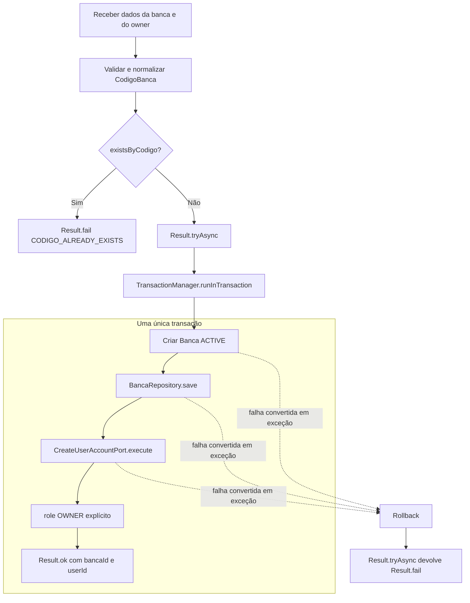

# Tenancy — domínio do tenant `Banca`

## Responsabilidade e limite do bounded context

Tenancy responde por **qual organização existe no sistema e se ela está operacional**. Seu agregado [`Banca`](./src/banca/banca.entity.ts) possui identidade, código usado como subdomínio, nome e status. Esses dados mudam por motivos de ciclo de vida do tenant, portanto pertencem a Tenancy — não a Identity.

Contas, credenciais e sessões pertencem a [Identity](../identity/README.md). Tenancy não acessa entidades ou repositórios internos daquele módulo. No provisionamento, depende somente da port de entrada `CreateUserAccountPort`. No sentido de dependência entre pacotes, `shared ← identity ← tenancy`; Identity nunca importa Tenancy e resolve contexto de tenant por sua própria port de saída `BancaContextResolver`.

O pacote contém regras e aplicação em TypeScript puro. Prisma, NestJS, `AsyncLocalStorage`, seed e composition root são infraestrutura externa.

## Agregado `Banca`

[`Banca`](./src/banca/banca.entity.ts) é a raiz do tenant, identificada por `id`. `tryCreate` exige:

- `id` válido;
- `codigoBanca` válido por `CodigoBanca`;
- `status` válido por `BancaStatus`;
- `nome` não vazio depois de `trim`.

O agregado armazena `codigoBanca` já **normalizado**. Por isso, ao reconstruir seu VO, `raw` e `normalized` têm o mesmo valor lowercase; a grafia original fornecida na entrada não é preservada no estado persistível. `activate()` e `deactivate()` retornam novas instâncias em `Result<Banca>`, e `isActive()` consulta o status. Não há setters públicos nem transição implícita.

O helper privado `rebuild` reaplica `tryCreate` sobre clone raso dos props. Ele mantém as invariantes e evita o `deepMerge` genérico da entidade-base. Embora `Banca` hoje não possua datas próprias além das herdadas, a convenção é consistente com os demais agregados.

### Value Objects

| Value Object | Invariantes e finalidade |
|---|---|
| [`CodigoBanca`](./src/banca/vo/codigo-banca.vo.ts) | aplica `trim` + lowercase em `normalized`; aceita de 3 a 30 caracteres, deve começar/terminar com letra ou número e permite hífen apenas no meio; rejeita `www`, `api`, `admin`, `app`, `status`; `value` é cópia defensiva |
| [`BancaStatus`](./src/banca/vo/banca-status.vo.ts) | aplica `trim` + uppercase; aceita somente `ACTIVE` ou `INACTIVE`; `isActive` é verdadeiro apenas para `ACTIVE` |

A regex canônica de `CodigoBanca` é `^[a-z0-9][a-z0-9-]{1,28}[a-z0-9]$` (forma equivalente à expressão agrupada do código). Reservas evitam colisão entre tenant e subdomínios operacionais da plataforma. A lista precisa permanecer alinhada com a resolução de host da infraestrutura.

`Banca` é entidade rica porque tem identidade e controla seu ciclo de vida. Reduzi-la a dados anêmicos permitiria persistir nome/código/status inválidos ou espalhar transições por controllers e adapters.

## Casos de uso

### `GetBancaContextUseCase`

[`GetBancaContextUseCase`](./src/banca/use-case/get-banca-context.use-case.ts) é a leitura pública mínima consumida pela resolução de tenant.

- Entrada: `{ codigoBanca }`.
- Saída: `{ bancaId, isActive }`.
- Fluxo: valida/normaliza `CodigoBanca`, chama `BancaRepository.findByCodigo` e projeta apenas o contexto.
- Privacidade: código inválido ou banca inexistente resulta no mesmo `TENANCY.BANCA_NOT_FOUND`; a entidade `Banca` nunca cruza a fronteira.
- Ports/objetos: `CodigoBanca` e `BancaRepository`.
- Efeito e transação: somente leitura, sem transação própria.
- Erros: `BANCA_NOT_FOUND` para entrada inválida/ausente; falhas do repositório são propagadas.

O caso de uso devolve `isActive=false` para uma banca existente e inativa; cabe ao consumidor decidir a mensagem segura. Identity converte contexto ausente/inativo em credenciais inválidas no login.

### `ProvisionBancaUseCase`

[`ProvisionBancaUseCase`](./src/app/use-case/provision-banca.use-case.ts) é um orquestrador interno de aplicação; não existe endpoint HTTP para ele no MVP. Ele cria uma banca `ACTIVE` e a primeira conta `OWNER` de forma atômica.

- Entrada: `{ codigoBanca, nome, owner: { username, name, password, email? } }`.
- Saída: `{ bancaId, userId }`.
- Pré-condições: código válido e ainda inexistente. A checagem `existsByCodigo` é uma guarda antecipada; a constraint única da persistência continua necessária contra concorrência.
- Objetos/ports: `CodigoBanca`, `Banca`, `BancaStatus`, `BancaRepository`, `CreateUserAccountPort` e `TransactionManager`.
- Efeitos: salva a `Banca` e chama Identity com o novo `bancaId` e `role: 'OWNER'` explícito.
- Erros: `CODIGO_INVALID`/`CODIGO_RESERVED`, `CODIGO_ALREADY_EXISTS`, `NOME_INVALID`, falhas de repositório e qualquer falha devolvida pela criação da conta.

`Result.tryAsync` envolve `TransactionManager.runInTransaction`. Dentro do callback, falhas de construção, save ou criação do OWNER são convertidas em exceção. Isso é deliberado: `runInTransaction` faz rollback ao receber uma exceção; `Result.tryAsync` a captura e devolve `Result.fail` ao chamador. Logo, nunca deve permanecer uma banca sem sua primeira conta.

### Fluxo atômico de provisionamento

Este é o diagrama canônico do fluxo. Ele responde: **quais escritas pertencem à mesma unidade atômica e como uma falha vira rollback?**



Na infraestrutura real, uma composition root externa fornece adapters de Banca e Identity e um `TransactionManager` compartilhado. Assim, ambos participam da mesma transação sem contexto Prisma aparecer nas assinaturas do domínio.

## Relação Identity ↔ Tenancy sem ciclo

Tenancy importa de `@bancaflow/identity` somente o **tipo de entrada** [`CreateUserAccountPort`](../identity/src/user-account/use-case/create-user-account.use-case.ts). O caso de uso não instancia `UserAccount`, não acessa `UserAccountRepository` e não conhece hash de senha.

No sentido inverso, Identity não importa este pacote. Sua [`BancaContextResolver`](../identity/src/shared/ports/banca-context-resolver.port.ts) expressa o contexto mínimo necessário; um adapter do backend usa `GetBancaContextUseCase` para implementá-la. A composition root conecta as duas pontas. Essa inversão preserva `shared ← identity ← tenancy`, elimina dependência circular e dispensa `forwardRef` no domínio.

## Port `BancaRepository`

[`BancaRepository`](./src/banca/banca.repository.ts) é uma port de saída definida por Tenancy e implementada pela infraestrutura:

| Operação | Contrato |
|---|---|
| `nextId()` | gera o identificador da nova banca sem acoplar o domínio ao banco |
| `findByCodigo(normalizedCodigo)` | busca por código já normalizado |
| `findById(id)` | busca pela identidade |
| `existsByCodigo(normalizedCodigo)` | guarda de unicidade usada no provisionamento |
| `save(banca)` | persiste o agregado sem expor tipo Prisma |

O domínio define a port porque é ele que precisa dessas operações. A infraestrutura depende do contrato e deve mapear banco ↔ `Banca`, usando `codigoBanca.normalized` como forma autoritativa.

## Catálogo de erros

[`TENANCY_ERRORS`](./src/shared/errors/tenancy.errors.ts) contém os códigos públicos estáveis:

| Constante | Código | Uso principal |
|---|---|---|
| `CODIGO_INVALID` | `TENANCY.CODIGO_INVALID` | formato fora da regex |
| `CODIGO_RESERVED` | `TENANCY.CODIGO_RESERVED` | subdomínio reservado |
| `CODIGO_ALREADY_EXISTS` | `TENANCY.CODIGO_ALREADY_EXISTS` | unicidade no provisionamento |
| `NOME_INVALID` | `TENANCY.NOME_INVALID` | nome vazio após `trim` |
| `STATUS_INVALID` | `TENANCY.STATUS_INVALID` | estado fora de `ACTIVE`/`INACTIVE` |
| `BANCA_NOT_FOUND` | `TENANCY.BANCA_NOT_FOUND` | resposta pública genérica de contexto |

O backend é responsável por traduzir códigos em HTTP e mensagens seguras. Falhas técnicas dos adapters podem ser propagadas em `Result.fail`, mas não devem virar novos códigos literais de domínio sem decisão explícita.

## Estrutura de pastas

```text
modules/tenancy/
├── src/
│   ├── banca/
│   │   ├── banca.entity.ts                  # agregado e transições
│   │   ├── banca.repository.ts              # port de persistência
│   │   ├── vo/                              # código/subdomínio e status
│   │   └── use-case/
│   │       └── get-banca-context.use-case.ts # projeção pública mínima
│   ├── app/use-case/
│   │   └── provision-banca.use-case.ts      # coordenação Banca + OWNER
│   ├── shared/errors/                       # catálogo público
│   └── index.ts                             # superfície pública
└── test/
    ├── support/fakes.ts                     # repo, port de Identity e tx
    └── *.spec.ts                            # regras, aplicação e rollback
```

Não há `domain service`: as regras locais estão em `Banca`/VOs e a coordenação entre bounded contexts está no caso de uso de aplicação `ProvisionBancaUseCase`. Um serviço de domínio seria adequado apenas para uma política pura entre objetos do domínio que não coubesse naturalmente no agregado.

## Estratégia de testes

[`test/support/fakes.ts`](./test/support/fakes.ts) mantém os testes independentes da infraestrutura:

- `InMemoryBancaRepository` implementa buscas/guarda/save, permite falhas e oferece snapshot/restore;
- `FakeCreateUserAccountPort` registra a entrada — inclusive `bancaId` e `role: 'OWNER'` — e pode falhar sem importar o agregado de Identity;
- `RollbackTransactionManager` restaura o snapshot quando o callback lança, provando a semântica usada por `ProvisionBanca`;
- `PassthroughTransactionManager` representa o caminho bem-sucedido.

Specs de referência:

- [`codigo-banca.vo.spec.ts`](./test/codigo-banca.vo.spec.ts): regex, normalização e reservados;
- [`banca-status.vo.spec.ts`](./test/banca-status.vo.spec.ts): estados e normalização;
- [`banca.entity.spec.ts`](./test/banca.entity.spec.ts): criação, armazenamento normalizado e transições;
- [`get-banca-context.use-case.spec.ts`](./test/get-banca-context.use-case.spec.ts): projeção, normalização e erro genérico;
- [`provision-banca.use-case.spec.ts`](./test/provision-banca.use-case.spec.ts): OWNER explícito, unicidade, falhas e rollback quando a conta não é criada.

Execute com `npm test --workspace @bancaflow/tenancy` a partir da raiz.

## Erros comuns ao evoluir este módulo

- Colocar `UserAccount`, credencial ou sessão dentro de Tenancy, misturando motivos de mudança.
- Fazer Identity importar `Banca` ou `GetBancaContextUseCase`; o contexto deve atravessar `BancaContextResolver`.
- Persistir a grafia original do código em vez da forma normalizada autoritativa.
- Validar subdomínio apenas no middleware e deixar `CodigoBanca` aceitar estado inválido.
- Devolver `Banca` na leitura pública em vez de `{ bancaId, isActive }`.
- Criar banca e OWNER em transações separadas, ou retornar `Result.fail` dentro de `runInTransaction` sem lançar para provocar rollback.
- Assumir `OWNER` como default; o papel deve ser explícito.
- Esconder regra de domínio no adapter Prisma ou importar tipos de framework/banco neste pacote.
- Tratar `existsByCodigo` como proteção suficiente e remover a constraint única contra corridas.
- Expor senha, hash, token, secret ou dados de seed na documentação/logs.

## Leituras de contexto (CQRS)

- **Pública por `codigoBanca`** — `GetBancaContextUseCase` (inalterada): resolve tenant do subdomínio e retorna somente `{ bancaId, isActive }`. Continua sendo o contrato usado pelo login.
- **Autenticada por `bancaId`** — `GetBancaDisplayContextUseCase` + a port de leitura `BancaDisplayContextQuery` (`banca/query`), projeção `BancaDisplayContextView` (`{ bancaId, codigoBanca, nome }`) **somente para banca ativa**. Serve à composição de `GET /api/auth/me` (via adapter que satisfaz uma port do Identity). Banca inexistente/inativa → falha genérica `BANCA_NOT_FOUND`, não enumerável. A entidade `Banca` não cruza a fronteira: a projeção vem da query, não do repositório.

## Checklist para adicionar um novo caso de uso/regra

- [ ] Confirmar que a regra trata do ciclo de vida do tenant; regras de conta/sessão ficam em Identity.
- [ ] Colocar invariantes de valor em VO, transições locais em `Banca` e coordenação em caso de uso.
- [ ] Definir entrada/saída mínima; não deixar a entidade cruzar fronteiras de leitura pública.
- [ ] Reutilizar `BancaRepository` ou acrescentar a menor operação necessária, sempre com valores normalizados.
- [ ] Manter dependência unidirecional; integrações com Identity usam ports e composition root externa.
- [ ] Escolher explicitamente `runInTransaction`/`runInTransactionResult` e provar rollback de todas as escritas.
- [ ] Retornar códigos de `TENANCY_ERRORS` e preservar respostas não enumeráveis quando públicas.
- [ ] Criar fakes e testar caminho feliz, formato/normalização, falhas de cada port, concorrência/unicidade e rollback.
- [ ] Exportar a superfície pública em [`src/index.ts`](./src/index.ts) e atualizar este README.
